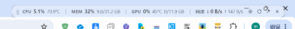
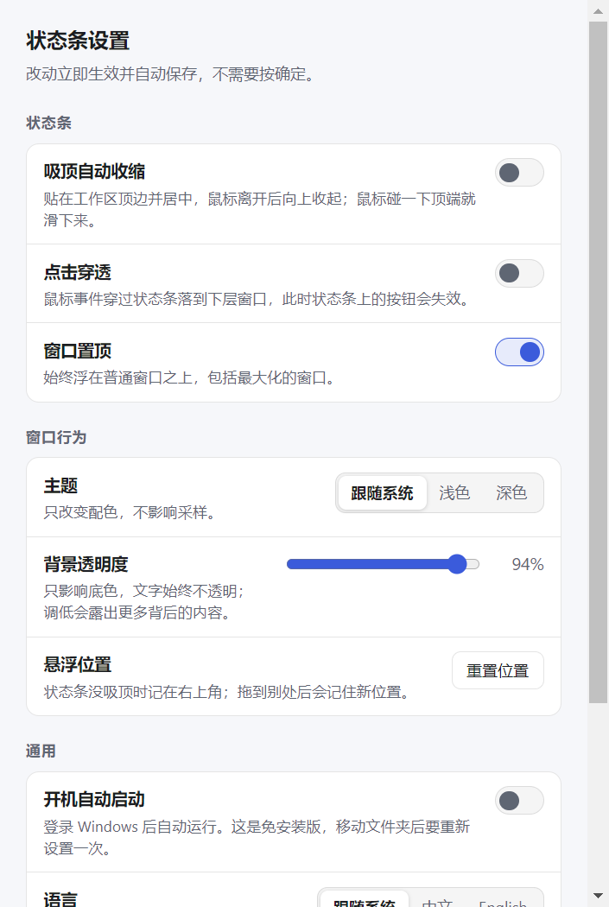

# dsh-system-monitor-desktop

中文 | [English](README.en.md)

**作者：DeepSeek + DeepSeek-Harness**

[DeepSeek Harness 系统监视器](https://github.com/GNX001/dsh-system-monitor) 的 **Windows 独立桌面版**：不需要 Harness，双击就能跑的一条置顶状态条。


```
⣿ CPU 3.2% 71.9°C 丨 MEM 29% 9.1/31.2 GB 丨 GPU 0% 44°C 0/11.9 GB 丨 网速 ↓ 20.1 KB/s ↑ 5.1 KB/s  ⚙ ⟳ 📌 ✕
```

## 功能

| 功能 | 说明 |
| --- | --- |
| **吸顶自动收缩** | 钉住后**保持自身宽度**居中贴在工作区顶端；鼠标离开 0.6 秒就向上收起，只在屏幕顶端留 6px 细边；鼠标碰到顶端立刻滑下来。 |
| **窗口置顶** | 一直浮在普通窗口之上，包括最大化的浏览器。可在设置或托盘里关掉。 |
| **点击穿透** | 开启后鼠标事件直接穿过状态条落到下层窗口，状态条变成纯显示。 |
| **图钉按钮** | 按钮区从右往左依次是 `✕` 关闭、**`📌` 图钉**、`⟳` 刷新、`⚙` 设置。图钉就在关闭按钮前面，一键开关吸顶收缩，开启时高亮按下态。 |
| **设置界面** | `⚙` 或托盘菜单打开。开关、主题、透明度、语言都是即时生效、自动保存，没有「确定」按钮。 |
| **主题** | 跟随系统 / 浅色 / 深色。 |
| **背景透明度** | 20%–100% 实时预览，只调底色，文字始终不透明。 |
| **不占任务栏** | 只出现在托盘，任务栏不会多出一个图标。 |
| **开机自动启动** | 设置里一键开关。 |

吸顶展开、收起，以及调暗背景的样子（真实桌面截取，不是示意图）：

| 钉住 · 展开（自身宽度，居中） | 钉住 · 收起（只在顶端留 6px） | 透明度 35% |
| --- | --- | --- |
|  |  |  |

设置界面：`⚙` 按钮、托盘菜单「设置…」，或 `npm start` 后按需打开。



## 运行

### 直接跑打包版

到 [最新版本](https://github.com/GNX001/dsh-system-monitor-desktop/releases/latest) 下载 `dsh-system-monitor-desktop-<版本>-win-x64.zip`（约 110 MB），解压后双击 `dsh-system-monitor-desktop.exe`。免安装、不写注册表，删掉文件夹就是卸载。

### 从源码跑

```sh
npm install
npm run icons     # 生成 assets/icon.png、icon.ico、tray.png（脚本自己画，无图像库依赖）
npm start
```

### 打包

```sh
npm run dist      # 输出到 dist/dsh-system-monitor-desktop-win-x64/
```

## 操作

- **拖动**：悬浮状态下按住状态条任意位置拖（按钮除外）。吸顶后不可拖动——位置由屏幕边缘决定。
- **`⚙` 设置**：打开设置界面。
- **`⟳` 刷新**：立刻重新探测一次硬件，不等下一个采样周期。
- **`📌` 图钉**：开关吸顶自动收缩。
- **`✕` 关闭**：把状态条收进托盘（**不退出程序**）。要从托盘恢复，左键单击托盘图标，或用菜单里的「显示 / 隐藏状态条」。
- **托盘菜单**：显示/隐藏、吸顶自动收缩、点击穿透、窗口置顶、设置、重置位置、打开配置文件夹、退出。

> 吸顶**保持自身宽度**，不会拉成一条横跨整屏的色带。收起时留在屏幕顶端的是状态条自己宽度的 6px 圆角细边，鼠标移到它上面就展开。

## 关于点击穿透：怎么关掉它

点击穿透开启后，状态条不再接收任何鼠标事件——**状态条上的按钮点不动了**，这是这个功能的本质，不是 bug。开启时按钮会明显变暗、边框变虚线，就是为了让这件事一眼可见。两条退路：

1. **托盘菜单**（最可靠）：右键托盘图标 → 取消勾选「点击穿透」。
2. **全局快捷键**：依次尝试 `Ctrl+Alt+L`、`Ctrl+Alt+B`、`Ctrl+Alt+Y`，取第一个注册成功的（被别的软件占用就顺延）。实际生效的那个写在托盘菜单和设置界面里。

吸顶自动收缩开启时，鼠标仍然能唤出状态条——悬停检测读的是**屏幕光标位置**（`screen.getCursorScreenPoint`），不依赖窗口收到鼠标事件，所以点击穿透和自动收缩可以同时用。

### 它到底生效了吗？有一条命令可以问 Windows

`setIgnoreMouseEvents` 本身不返回任何结果，所以这个仓库内置了一个直接问操作系统的自检：

```sh
npm run probe          # 输出到 ./probe
```

它会逐个状态读回窗口的扩展样式位（`WS_EX_TRANSPARENT` 有没有真的设上）、用 `WindowFromPoint` 问 Windows「这个坐标属于哪个窗口」，再发一次**真实鼠标点击**看它落到谁身上，然后把窗口按正常使用那样拖动、置顶、隐藏再显示、吸顶展开收起一遍——每步之后都重新读一次，确认这一位没被这些操作弄丢。

一次实测输出（点击穿透开启时）：

```
[probe] on-no-options
[probe]   exStyle=0x00080028 bits={"transparent":true,"layered":true,"topmost":true,...}
[probe]   windowFromPoint=66018|SysListView32|FolderView  pointHitsBar=false
[probe]   real click at (2433,41) -> renderer saw 0; foreground after: 66014|Progman|Program Manager
[probe]   -> click-through EFFECTIVE
```

读法：`transparent:true` 表示样式位真的设上了；`pointHitsBar=false` 表示 Windows 认为那个坐标不属于状态条；真实点击后前台窗口变成 `Progman`（桌面本身）而状态条的渲染进程「看到 0 次点击」——点击确实穿过去了。对照组（穿透关闭时）是反过来的：`transparent:false`、`pointHitsBar=true`、真实点击被渲染进程收到。

## 配置

设置存在 `%APPDATA%\dsh-system-monitor-desktop\settings.json`，可直接编辑（托盘 → 打开配置文件夹）：

```jsonc
{
  "pinned": false,        // 吸顶自动收缩
  "clickThrough": false,  // 点击穿透
  "alwaysOnTop": true,    // 窗口置顶
  "openAtLogin": false,   // 开机自动启动
  "theme": "auto",        // auto | light | dark
  "opacity": 0.94,        // 背景透明度，0.2–1
  "position": null,       // 悬浮位置 {x, y}；null = 右上角
  "language": "auto"      // auto | zh | en
}
```

文件损坏、字段缺失或类型不对都会退回默认值，不会启动失败；透明度超出 0.2–1 会被夹回范围内（完全透明会让文字飘在桌面背景上，读不了）。

## 各项数值来自哪里

采集代码与 Harness 插件**逐字节相同**（`tools/verify-vendor.mjs` 会校验，见下），所以数值口径完全一致：

| 指标 | 来源 |
| --- | --- |
| CPU 占用率 | `os.cpus()` 逐核心 jiffies 差分 |
| 内存 | `os.totalmem()` / `os.freemem()`（「可用内存」口径，与任务管理器一致） |
| CPU 温度 | ACPI 热区 PDH 计数器，经 `typeperf` |
| GPU | `nvidia-smi`（含温度、显存、功耗）；没有则退回厂商中立的 Windows GPU 性能计数器（仅占用率） |
| 网速 | PDH 网络计数器，自动排除回环/虚拟适配器，避免重复计算 |

**零运行时依赖**：不装驱动、不提权、不联网、只读。唯一的进程外调用是 `typeperf` 与 `nvidia-smi`，都是系统自带或显卡驱动自带的工具。

> **关于 Windows 的 CPU 温度单位**：PDH 计数器普遍被文档写作「开尔文」，但 ACPI 底层的 `_TMP` 是分度开尔文。实测（Windows 11 + AMD 笔记本）：空闲约 355、4 线程持续满载后稳定在约 367。按开尔文读就是 82 °C → 94 °C，正是一颗笔记本 CPU 卡在 95 °C 温控阈值下方；按分度摄氏度读则变成满载只升温 1.2 °C，任何物理封装都不会这样。因此按开尔文读。

## 代码来源

`src/shared/` 下的 10 个文件是从 [dsh-system-monitor](https://github.com/GNX001/dsh-system-monitor) 复制来的（8 个采集器 + 视图模型 + 双语字典），逐字节未改。这样两个产品对同一个读数会用同样的格式和同样的颜色阈值。

复制件最容易悄悄漂移，所以做了两重固定：

```sh
node tools/verify-vendor.mjs           # 对照 tools/vendored.json，并在有插件源码时逐字节比对
node tools/verify-vendor.mjs --write   # 重新记录哈希（有意升级复制件时用）
```

`test/app.test.mjs` 只依赖 `tools/vendored.json`，所以即使没有插件源码也能发现漂移。

## 开发

```sh
npm test        # node --test "test/*.test.mjs"
npm run icons   # 重新生成图标
npm run dist    # 打包免安装版
```

### 自检诊断

GUI 应用没法只靠单元测试验证，而这个项目在开发时也没有人能盯着屏幕，所以内置了几个会自己走一遍、并把结果写成文字和图片的诊断。它们都是 `electron . --xxx`，打包版同样可用。

```sh
npm run capture                 # 走一遍所有状态并截图到 ./capture
npm run probe                   # 问 Windows 点击穿透到底生效没有，到 ./probe
npm run drag                    # 用真实鼠标输入拖动状态条，输出到 ./drag
npm run login-test              # 往返一次开机启动项（测完恢复原状）
```

也可以指定目录：`npm start -- --capture=D:\shots`。

| 诊断 | 它回答的问题 |
| --- | --- |
| `--capture` | 每个状态（悬浮 / 吸顶展开 / 吸顶收起 / 点击穿透 / 浅色半透明 / 深色不透明 / 设置界面）在真实桌面上到底是什么样。全屏截图 + 状态条本体截图 + 状态条附近的一条带状截图，每步的窗口坐标、主题、透明度、指标数值都写进 `log.txt`。 |
| `--probe` | 点击穿透是否真的生效（读回扩展样式位 + `WindowFromPoint` + 真实点击），以及这一位在拖动、置顶、隐藏显示、吸顶循环之后还在不在。坐标按 DPI 换算成物理像素，否则注入的鼠标会落到别的地方。 |
| `--drag` | 拖动顺不顺：真实注入一段拖拽，统计收到多少移动事件、拖动**过程中**向窗口写了多少次边界（这些写入正是卡顿来源，现在被推迟到拖拽结束后一次性应用），以及一次拖动中途的写入会把状态条从指针下拽走多少像素。 |
| `--login-test` | 开机启动项是否真的写进去了（读回注册表），测完恢复原值。 |

### 目录结构

| 路径 | 说明 |
| --- | --- |
| `src/main/docking.js` | 吸顶几何与自动伸缩状态机（纯函数，无 Electron 依赖，可单测） |
| `src/main/settings.js` | 设置规范化（纯函数） |
| `src/main/store.js` | JSON 读写（原子写、读失败退回默认值） |
| `src/main/win-probe.js` | 诊断用：把 PowerShell 交给 `-EncodedCommand` 执行 P/Invoke，读窗口样式位、做命中测试、注入真实鼠标 |
| `src/main/index.js` | 窗口、托盘、IPC、采集循环、拖动检测都在这一层 |
| `src/renderer/` | 状态条本体：原生 DOM，无框架 |
| `src/settings/` | 设置界面：原生 DOM，无框架 |
| `src/shared/` | 从插件复制的采集器与视图模型 |
| `tools/` | 图标生成、打包、复制件校验 |

## 已知限制

- **仅 Windows**。吸顶几何本身是跨平台的，但托盘、置顶层级、点击穿透和拖动行为都按 Windows 调过。
- **macOS 不适用**，本仓库也不打算支持。
- 网速与 GPU 的采样各要起一个短命进程（`typeperf` / `nvidia-smi`），分别每 2 秒、1.5 秒一次；CPU 温度每 4 秒。机器极忙时数值会有几秒延迟，这是设计如此——状态条永远不等硬件。
- 开机自动启动写的是当前 exe 的完整路径：这是免安装版，**把文件夹挪走之后需要重新设置一次**。
- 设置界面和状态条一样不进任务栏，靠 `⚙` 或托盘菜单打开；被别的窗口盖住时再点一次即可。
- 版本 0.x，配置项仍可能变动。

## 许可

**The Unlicense** —— 完全自由，无任何使用条件。可以出于任何目的、以任何方式复制、修改、发布、使用、编译、出售或分发，源码或二进制皆可，商用非商用皆可，**无需署名、无需保留任何声明、无需遵守任何条款**。全文见 [LICENSE](LICENSE)。
